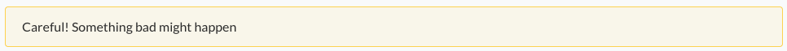
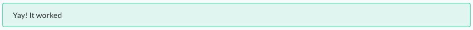
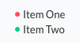
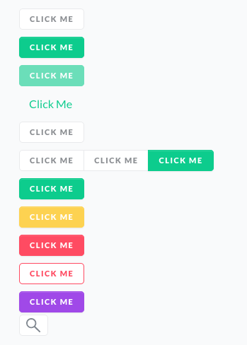
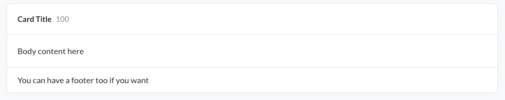
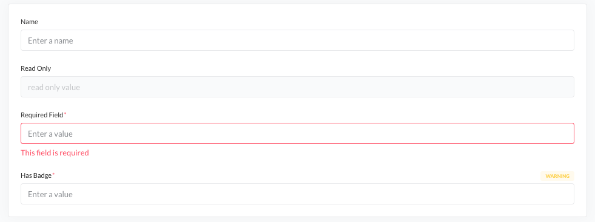
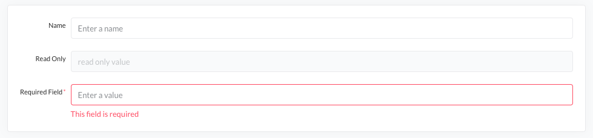
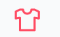
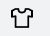

<h1 align="center">
  SCAYLE Tailwind Base Library
</h1>

<h4 align="center">
  <a href="https://scayle.dev">Documentation</a> |
  <a href="https://www.scayle.com/">Website</a>
</h4>

<p align="center">
  The SCAYLE <strong>Tailwind Base Library</strong> offers a Panel tailwind preset.
</p>

<p align="center">
  <a href="#"></a>
  <a href="https://www.npmjs.com/package/@scayle/tailwind-base"></a>
</p>

## Getting Started

Visit the [Add-On Developer Guide](https://scayle.dev/en/dev/add-on/introduction) to learn more on how to use the Panel icons.

Visit the [Docs](https://scayle.dev) to learn more about our system requirements.

## What is Scayle ?

[SCAYLE](https://scayle.com) is a full-featured e-commerce software solution that comes with flexible APIs. Within SCAYLE, you can manage all aspects of your shop, such as products, stocks, customers, and transactions.

Learn more about [Scayles’s architecture]() and [commerce modules]() in the Docs.

# @scayle/tailwind-base

> A base Tailwind preset for SCAYLE projects.
> It includes our core colors, fonts, and sizes along with a few plugins.
> Based on the SCAYLE Style Guide

## Installation

```shell
npm i -S @scayle/tailwind-base
```

## Usage

Add the following to your tailwind config:

```javascript
presets: [require('@scayle/tailwind-base')]
```

Or if you don't want to include the default plugins:

```javascript
presets: [require('@scayle/tailwind-base/core')]
```

## Fonts

This preset uses [Lato v1](https://www.latofonts.com/), [Noto Sans Arabic](https://fonts.google.com/noto/specimen/Noto+Sans+Arabic) and [Noto Sans Hebrew](https://fonts.google.com/noto/specimen/Noto+Sans+Hebrew) in the default font-family, but the fonts are not bundled with this package.
You must load them yourself.

e.g. Using Google Fonts

```css
@import url('https://fonts.googleapis.com/css2?family=Lato:ital,wght@0,400;0,700;0,900;1,400;1,700;1,900&family=Noto+Sans+Arabic:wght@400;700;900&family=Noto+Sans+Hebrew:wght@400;700;900&display=swap');
```

or

```html
<link rel="preconnect" href="https://fonts.googleapis.com" />
<link rel="preconnect" href="https://fonts.gstatic.com" crossorigin />
<link
  href="https://fonts.googleapis.com/css2?family=Lato:ital,wght@0,400;0,700;0,900;1,400;1,700;1,900&family=Noto+Sans+Arabic:wght@400;700;900&family=Noto+Sans+Hebrew:wght@400;700;900&display=swap"
  rel="stylesheet"
/>
```

## Colors

The settings defined in the preset will be [merged](https://tailwindcss.com/docs/presets#merging-logic-in-depth) with Tailwind's [default configuration](https://unpkg.com/browse/tailwindcss@%5E3/stubs/defaultConfig.stub.js) with the exception of colors and screen breakpoints.

The idea behind this is that the palette defined here should be used in most cases, and many colors in the Tailwind palette would be lost in a merge anyway because of name conflicts.

If you need to use any colors in the Tailwind palette, they can be imported from the Tailwind package.

```typescript tailwind.config.js
const tailwindColors = require('tailwindcss/colors');
module.exports = {
  theme: {
    extend: {
      colors: {
        'custom-color': 'rgb(255, 0, 0)',
        ...tailwindColors,
      },
    },
  },
};
```

# Plugins

This package includes a collection of plugins for Tailwind. Most are included by default in the preset, but they can also be used individually. Because plugins added in a preset cannot be removed, if you only want to use some plugins, use the core preset and explicitly add the plugins you want.

## Base

The following plugins adjust styles in Tailwind's [`base` layer](https://tailwindcss.com/docs/plugins#adding-base-styles). 
None of them are included in the default preset.

### Base

`@scayle/tailwind-base/plugins/base.js`

This plugin applies some base styles to built-in elements, such as headings, `a` and `img`.

### Env

`@scayle/tailwind-base/plugins/env.js`

The env plugin adds two custom properties to the `body` element: `--env-color` and `--env-name`. The values of these custom properties are determined by the panel environment.

It also adds the utility classes `bg-env-color` for setting the background based on the environment and `color-env` for the text color.

### Element-Plus

`@scayle/tailwind-base/plugins/element-plus.js`

This plugin sets [element-plus css variables](https://element-plus.org/en-US/guide/theming.html#by-css-variable) based on the tailwind config.
It is not included in the default preset.

## Utilities

The following plugins add additional utilities to Tailwind's [`utilities` layer](https://tailwindcss.com/docs/plugins#adding-utilities).

### Filter Color

Utility classes to create filter rules that apply a specific theme color.
Can be used for coloring svg or transparent png icons that are loaded through an `img` tag.

Creates a `filter-[theme-color-name]` class for each theme color.

### MultiColumn

`@scayle/tailwind-base/plugins/multiColumn.js`

This plugin adds utility classes for building a [Multi-column Layout](https://developer.mozilla.org/en-US/docs/Web/CSS/CSS_Columns).

#### Column Span

Utility classes for controlling the [column-span](https://developer.mozilla.org/en-US/docs/Web/CSS/column-span)

| Class           | Properties          |
| --------------- | ------------------- |
| `col-span-all`  | `column-span: all`  |
| `col-span-none` | `column-span: none` |

#### Column Count

Utility classes for controlling the [column-count](https://developer.mozilla.org/en-US/docs/Web/CSS/column-count)

| Class                  | Properties               |
| ---------------------- | ------------------------ |
| `col-count-1`          | `column-count: 1`        |
| `col-count-2`          | `column-count: 2`        |
| `col-count-3`          | `column-count: 3`        |
| `col-count-auto`       | `column-count: auto`     |
| `col-count-[<number>]` | `column-count: <number>` |

#### Column Rule Width

Utility classes for controlling the [column-rule-width](https://developer.mozilla.org/en-US/docs/Web/CSS/column-rule-width).

| Class            | Properties                    |
| ---------------- | ----------------------------- |
| `rule-thin`      | `column-rule-width: thin`     |
| `rule-medium`    | `column-rule-width: medium`   |
| `rule-thick`     | `column-rule-width: thick`    |
| `rule-[<length]` | `column-rule-width: <length>` |

#### Column Rule Color

Utility classes for controlling the [column-rule-color](https://developer.mozilla.org/en-US/docs/Web/CSS/column-rule-color).

Creates a `rule-[theme-color-name]` class for each theme color. Additionally, it supports the arbitrary value syntax so you can add classes like `rule-[#FF0000]`.

#### Column Rule Style

Utility classes for controlling the [column-rule-style](https://developer.mozilla.org/en-US/docs/Web/CSS/column-rule-style).

| Class         | Properties                  |
| ------------- | --------------------------- |
| `rule-none`   | `column-rule-style: none`   |
| `rule-hidden` | `column-rule-style: hidden` |
| `rule-dotted` | `column-rule-style: dotted` |
| `rule-dashed` | `column-rule-style: dashed` |
| `rule-solid`  | `column-rule-style: solid`  |
| `rule-double` | `column-rule-style: double` |
| `rule-groove` | `column-rule-style: groove` |
| `rule-ridge`  | `column-rule-style: ridge`  |
| `rule-inset`  | `column-rule-style: inset`  |
| `rule-outset` | `column-rule-style: outset` |

### No Scrollbar

`@scayle/tailwind-base/plugins/noScrollbar.js`

Adds a `no-scrollbar` class which hides the scrollbar while still allowing scroll.

```html
<div style="height: 50px" class="overflow-auto no-scrollbar">
  <div style="height: 75px" class="bg-yellow"></div>
  <div style="height: 75px" class="bg-blue"></div>
</div>
```

### Reset

`@scayle/tailwind-base/plugins/reset.js`

Adds a few classes to explicitly reset browser styles for certain elements.

### Scrollbar styles

`@scayle/tailwind-base/plugins/scrollbar.js`

Utilities for styling the scrollbar.

| Class            | Properties              |
| ---------------- | ----------------------- |
| `scrollbar-auto` | `scrollbar-width: auto` |
| `scrollbar-thin` | `scrollbar-width: thin` |
| `scrollbar-none` | `scrollbar-width: none` |

Additionally, it creates `thumb-[theme-color-name]` and `track-[theme-color-name]` classes for each theme color.

> 📝 You must specify both the thumb and track color. If only one is set, the default scrollbar colors will be used for both properties. [CSS Scrollbars](https://w3c.github.io/csswg-drafts/css-scrollbars/#scrollbar-color)

```html
<div
  style="height: 50px"
  class="overflow-auto track-red thumb-blue scrollbar-thin"
>
  <div style="height: 75px" class="bg-yellow"></div>
  <div style="height: 75px" class="bg-blue"></div>
</div>
```

These two properties also support the arbitrary value syntax.

```html
<div
  style="height: 50px"
  class="overflow-auto track-[#FF0000] thumb-[#0000FF] scrollbar-thin"
>
  <div style="height: 75px" class="bg-yellow"></div>
  <div style="height: 75px" class="bg-blue"></div>
</div>
```

## Components

The following plugins add styles for common CSS components to Tailwind's [`components` layer](https://tailwindcss.com/docs/plugins#adding-components).

### Alert

`@scayle/tailwind-base/plugins/alert.js`

```html
<div class="alert alert-warning">
  <span>Careful! Something bad might happen</span>
</div>
```



```html
<div class="alert alert-success">
  <span>Yay! It worked</span>
</div>
```



By default all theme colors are supported along with arbitrary values. For example, `alert-red` and `alert-[#FF0000]`.

### Avatar

`@scayle/tailwind-base/plugins/avatar.js`

Avatars consist of an `.avatar` element which contains either an `.avatar-image` element for icons and images or `.avatar-initials` for text. A `data-initials` attribute can also be added to `.avatar-image` elements. The text will be displayed if the image fails to load.

```html
<div class="avatar">
  
</div>

<div class="avatar">
  
</div>

<div class="avatar">
    
</div>

<div class="avatar">
  <IconCheckmark class="avatar-image bg-dark text-dark-grey fill-current" />
</div>

<div class="avatar">
  <div class="avatar-initials">XYZ</div>
</div>
```


There also some size presets for avatars.

| Class       | Properties                       |
| ----------- | -------------------------------- |
| `avatar-xs` | `height: '20px'; width: '20px';` |
| `avatar-sm` | `height: '29x'; width: '29x';`   |
| `avatar-md` | `height: '44px'; width: '44px';` |
| `avatar-lg` | `height: '60px'; width: '60px';` |
| `avatar-xl` | `height: '90px'; width: '90px';` |

```html
<div class="avatar avatar-xs">
  
</div>

<div class="avatar avatar-sm">
  
</div>

<div class="avatar avatar-md">
  
</div>

<div class="avatar avatar-lg">
  
</div>

<div class="avatar avatar-xl">
  
</div>
```


### Badge

`@scayle/tailwind-base/plugins/badge.js`

```html
<div>
  <span class="badge badge-red">Item one</span>
  <span class="badge badge-green">Item two</span>
</div>
```

By default all theme colors are supported along with arbitrary values. For example, `badge-red` and `badge-[#FF0000]`.

### Bullet

`@scayle/tailwind-base/plugins/bullet.js`

```html
<div class="flex flex-col">
  <span class="bullet bullet-red">Item one</span>
  <span class="bullet bullet-green">Item two</span>
</div>
```



By default all theme colors are supported along with arbitrary values. For example, `bullet-red` and `bullet-[#FF0000]`.

### Button

`@scayle/tailwind-base/plugins/button.js`

```html
<div>
  <button class="btn">Click Me</button>
  <br class="my-2" />
  <button class="btn btn-primary">Click Me</button>
  <br class="my-2" />
  <button class="btn btn-primary" disabled>Click Me</button>
  <br class="my-2" />
  <button class="btn btn-link">Click Me</button>
  <br class="my-2" />
  <button class="btn btn-text text-dark-grey">Click Me</button>
  <br class="my-2" />
  <div class="btn-group">
    <button class="btn">Click Me</button>
    <button class="btn">Click Me</button>
    <button class="btn btn-primary">Click Me</button>
  </div>
  <br class="my-2" />
  <button class="btn btn-success">Click Me</button>
  <br class="my-2" />
  <button class="btn btn-warning">Click Me</button>
  <br class="my-2" />
  <button class="btn btn-danger">Click Me</button>
  <br class="my-2" />
  <button class="btn btn-outline-red">Click Me</button>
  <br class="my-2" />
  <button class="btn btn-primary btn-env-based">Click Me</button>
  <br class="my-2" />
  <button class="btn btn-icon-only"><IconSearch class="icon icon-sm" /></button>
</div>
```



By default all theme colors are supported along with arbitrary values. For example, `btn-red`, `btn-[#FF0000]`, `btn-outline-red`, `btn-outline-[#FF0000]`.

### Card

`@scayle/tailwind-base/plugins/card.js`

```html
<div class="card">
  <div class="card-header">
    <h5>Card Title</h5>
    <span class="count">100</span>
  </div>
  <div class="card-body">Body content here</div>
  <div class="card-footer">You can have a footer too if you want</div>
</div>
```



### Forms & Labels

`@scayle/tailwind-base/plugins/forms.js`

```html
<div class="card">
  <div class="card-body grid gap-5">
    <label class="label">
      <span class="label-text">Name</span>

      <input
        class="form-control"
        placeholder="Enter a name"
        :disabled="false"
      />
    </label>

    <label class="label">
      <span class="label-text">Read Only</span>

      <input class="form-control" value="read only value" disabled="" />
    </label>

    <label class="label">
      <span class="label-text is-required">Required Field</span>

      <input
        class="form-control"
        placeholder="Enter a value"
        :class="{ 'is-invalid': true }"
      />

      <span class="invalid-feedback"> This field is required </span>
    </label>

    <label class="label">
      <span class="label-row">
        <span class="label-text is-required">Has Badge</span>
        <span class="label-badge badge-warning">Warning</span>
      </span>

      <input class="form-control" placeholder="Enter a value" />
    </label>
  </div>
</div>
```



```html
<div class="card">
  <div class="card-body form-horizontal">
    <label class="label-horizontal">
      <span class="label-horizontal-text">Name</span>

      <input
        class="form-control"
        placeholder="Enter a name"
        :disabled="false"
      />
    </label>

    <label class="label-horizontal">
      <span class="label-horizontal-text">Read Only</span>

      <input class="form-control" value="read only value" disabled="" />
    </label>

    <label class="label-horizontal">
      <span class="label-horizontal-text is-required">Required Field</span>

      <div>
        <input
          class="form-control"
          placeholder="Enter a value"
          :class="{ 'is-invalid': true }"
        />

        <span class="invalid-feedback"> This field is required </span>
      </div>
    </label>
  </div>
</div>
```



### Icon

`@scayle/tailwind-base/plugins/icon.js`

The icon plugin adds classes for working with svg icons.

The `icon` class adds some basic styling for icons.

```html
<IconStar class="icon"></IconStar>
```

Icons can be sized using width and height utilities.
There are also some standard size increments we use.

| Class             | Properties                             |
| ----------------- | -------------------------------------- |
| `icon-xs`         | `height: '1rem'; width: '1rem';`       |
| `icon-sm`         | `height: '1.25rem'; width: '1.25rem';` |
| `icon-md`         | `height: '1.5rem'; width: '1.5rem';`   |
| `icon-lg`         | `height: '2rem'; width: '2rem';`       |
| `icon-xl`         | `height: '3rem'; width: '3rem';`       |
| `icon-[<length>]` | `height: <length>; width: <length>`    |

```html
<IconStar class="icon icon-lg"></IconStar>
```

#### CSS Icons

It's also possible to use pure css icons. Add the `icon-bg` class, plus a class `icon-bg-[icon-name]`.
Icons are included from [`@scayle/panel-icons`](https://gitlab.com/aboutyou/cloud-panel/panel-packages/-/tree/main/icons).

```html
<div class="text-red">
  <div class="icon icon-bg icon-bg-shirt icon-xl"></div>
</div>
```



#### Colors

Icons will by default use the `currentColor`. You can change the color by using a text-color utility class.
If you add the `icon-native` class they will instead use the color from the svg file.

```html
<div class="text-red">
  <div class="icon icon-bg icon-bg-shirt icon-xl icon-native"></div>
</div>
```



### Spinner

`@scayle/tailwind-base/plugins/spinner.js`

To create a spinner, add an element with the `spinner` class and containing some spans. Each span will be an animated dot.

```html
<div class="spinner">
  <span></span>
  <span></span>
  <span></span>
  <span></span>
</div>
```

To change the dot color, add a text color class.

```html
<div class="spinner text-red">
  <span></span>
  <span></span>
  <span></span>
  <span></span>
</div>
```

A size class can also be added to change the spinner size. It supports arbitrary values of type length.

```html
<div class="spinner spinner-lg">
  <span></span>
  <span></span>
  <span></span>
  <span></span>
</div>
```

| Class                | Properties         |
| -------------------- | ------------------ |
| `spinner-xs`         | `width: '1em';`    |
| `spinner-sm`         | `width: '1.5em';`  |
| `spinner-md`         | `width: '3em';`    |
| `spinner-lg`         | `width: '4.5em';`  |
| `spinner-xl`         | `width: '6em';`    |
| `spinner-[<length>]` | `width: <length>;` |

The `spinner-overlay` class can be added to an element to display an opaque overlay on top. It can have rounded borders if `has-rounded-border` is also added. If the spinner has the `is-centered` class, it will be centered within the overlay.

```html
<div class="card spinner-overlay has-rounded-border">
  <div class="spinner is-centered">
    <span></span>
    <span></span>
    <span></span>
    <span></span>
  </div>
</div>
```

### Typography

`@scayle/tailwind-base/plugins/text.js`

| Class          | Properties                                                                         |
| -------------- | ---------------------------------------------------------------------------------- |
| `headline-36`  | `font-size: 36px; line-height: 44px; letter-spacing: normal; font-weight: black;`  |
| `headline-26`  | `font-size: 26px; line-height: 34px; letter-spacing: normal; font-weight: black;`  |
| `headline-19`  | `font-size: 36px; line-height: 28px; letter-spacing: normal; font-weight: black;`  |
| `headline-15`  | `font-size: 15px; line-height: 24px; letter-spacing: normal; font-weight: bold;`   |
| `headline-13`  | `font-size: 13px; line-height: 20px; letter-spacing: normal; font-weight: bold;`   |
| `headline-11`  | `font-size: 11px; line-height: 16px; letter-spacing: 0.1px; font-weight: bold;`    |
| `headline-9`   | `font-size: 9px; line-height: 14px; letter-spacing: 0.25px; font-weight: bold;`    |
| `paragraph-13` | `font-size: 13px; line-height: 20px; letter-spacing: normal; font-weight: normal;` |
| `paragraph-11` | `font-size: 11px; line-height: 18px; letter-spacing: 0.1px; font-weight: normal;`  |
| `paragraph-9`  | `font-size: 9px; line-height: 16px; letter-spacing: 0.25px; font-weight: bold;`    |
| `column-label` | `font-size: 9px; line-height: 16px; letter-spacing: 0.85px; font-weight: bold;`    |
| `btn-label`    | `font-size: 13px; line-height: 20px; letter-spacing: 0.8px; font-weight: black;`   |

## Other channels

- [LinkedIn](https://www.linkedin.com/company/scaylecommerce/)
- [Jobs](https://careers.smartrecruiters.com/ABOUTYOUGmbH/scayle)
- [AboutYou Tech Blog](https://aboutyou.tech/)

## License
Licensed under the [MIT](https://opensource.org/license/mit/)
